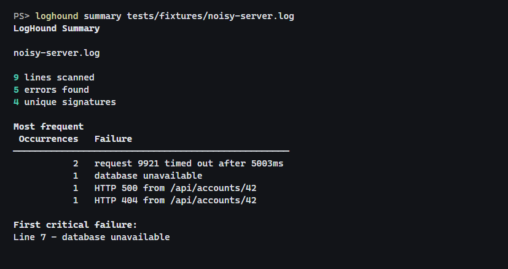
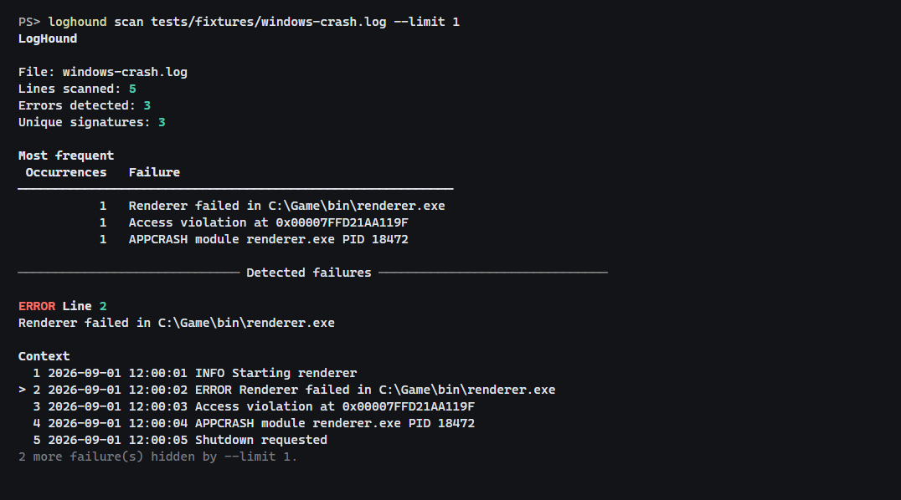

<div align="center">

# LogHound

**Sniff out the failure hiding amongst thousands of lines of noise.**

A local command-line log analyzer that finds failures, groups repeated errors into useful signatures, surfaces the surrounding context, and generates readable Markdown reports.

[](https://github.com/Speed126/LogHound/actions/workflows/tests.yml)


</div>

---

<p align="center">
  <a href="#demo">Demo</a> ·
  <a href="#what-it-does">Features</a> ·
  <a href="#installation">Installation</a> ·
  <a href="#usage">Usage</a> ·
  <a href="#how-it-works">How It Works</a> ·
  <a href="#fingerprinting">Fingerprinting</a> ·
  <a href="#tests">Tests</a>
</p>

---

LogHound is meant for the point where a log has become too noisy to read comfortably but you still just want to know:

* What actually failed?
* Which failures keep happening?
* Where did the first serious failure occur?
* What was happening around it?

**Local-first by design**

Everything runs on your machine. There are no accounts, remote services, databases, AI features, GUI, or telemetry.

## Demo

A quick summary gives you the shape of the problem.

```bash
loghound summary tests/fixtures/noisy-server.log
```
<p align="center">
  
</p>

When you need the actual surrounding lines:

```bash
loghound scan tests/fixtures/windows-crash.log --limit 1
```

<p align="center">
  
</p>

The same analysis can also be written to Markdown. An example is available in [`examples/example-report.md`](examples/example-report.md).

---

## What It Does

| Capability             | What it means                                                                       |
| ---------------------- | ----------------------------------------------------------------------------------- |
| **Failure detection**  | Finds common errors, exceptions, tracebacks, crashes, and critical failure markers  |
| **Signature grouping** | Collapses repeated failures even when timestamps, IDs, addresses, or timings change |
| **Context extraction** | Keeps nearby log lines attached to the failure that triggered them                  |
| **Quick summaries**    | Shows the most common problems and earliest critical failure without context spam   |
| **Detailed scans**     | Shows individual failures with line numbers and surrounding log entries             |
| **Markdown reports**   | Saves analysis results in a readable format for sharing or later review             |
| **Local operation**    | Reads local files without sending anything elsewhere                                |

LogHound does not require logs from a particular framework. It works from recognizable failure markers in plain-text input.

It also handles missing or unreadable files, empty logs, clean logs, and invalid UTF-8.

## Tech

|                          |                             |
| ------------------------ | --------------------------- |
| **Language**             | Python 3.11+                |
| **CLI**                  | Typer                       |
| **Terminal output**      | Rich                        |
| **Testing**              | pytest + pytest-cov         |
| **Linting / formatting** | Ruff                        |
| **CI**                   | GitHub Actions              |
| **CI versions**          | Python 3.11, 3.12, and 3.13 |

---

## Installation

LogHound requires **Python 3.11 or newer**.

Clone the repository and install it:

```bash
python -m pip install .
```

For development:

```bash
python -m pip install -e ".[dev]"
```

Then make sure the CLI is available:

```bash
loghound --help
```

---

## Usage

### Quick summary

```bash
loghound summary app.log
```

Use this when you mostly want to know which failures dominate the log and where the first critical failure appeared.

### Detailed scan

```bash
loghound scan app.log
```

Limit the number of displayed failures:

```bash
loghound scan app.log --limit 10
```

Control how many surrounding lines are captured:

```bash
loghound scan app.log --before 5 --after 10
```

Filter down to critical failures:

```bash
loghound scan app.log --severity critical
```

### Markdown report

```bash
loghound report app.log
```

Or choose the output path yourself:

```bash
loghound report app.log --output report.md
```

Without `--output`, the filename is based on the input log:

```text
server.log -> server-loghound-report.md
```

---

## How It Works

The pipeline is intentionally focused:

```text
                    log file
                       |
                       v
                    parser
         failure detection + severity
              + surrounding context
                       |
                       v
                 fingerprinter
          normalize volatile values
            + create stable signatures
                       |
                       v
                   analyzer
        counts + ranking + first critical
                       |
              +--------+--------+
              |                 |
              v                 v
          Rich CLI         Markdown report
```

The package follows those same boundaries:

```text
src/loghound/
|
+-- parser.py
|   reads logs and creates LogEvent objects
|
+-- fingerprint.py
|   turns noisy failure messages into stable signatures
|
+-- analyzer.py
|   groups events, ranks failures, and finds critical events
|
+-- report.py
|   creates Markdown output
|
+-- cli.py
    exposes the workflow through Typer and Rich
```

The architecture stays lean by design.

---

## Fingerprinting

This is the part that keeps a log containing 500 versions of essentially the same error from looking like 500 unrelated problems.

Consider:

```text
2026-09-01 12:05:03 ERROR request 9921 timed out after 5003ms
2026-09-01 12:05:05 ERROR request 9922 timed out after 5011ms
```

The timestamps changed.

The request IDs changed.

The durations changed.

The error is the same.

LogHound normalizes values like these before grouping failures:

| Normalized value | Example                                |
| ---------------- | -------------------------------------- |
| Timestamp / date | `2026-09-01 12:05:03`                  |
| UUID             | `90488152-89cb-43fa-882b-c01ba167de44` |
| Memory address   | `0x00007FFD21AA119F`                   |
| File path        | `C:\Game\bin\renderer.exe`             |
| Labeled ID       | `request 9921`, `PID 18472`            |
| Duration         | `12ms`, `5003 ms`, `5.2s`              |
| Data size        | `2048 bytes`, `512MB`                  |

Whitespace and casing are normalized as well.

The two timeout messages above therefore resolve to the same signature.

### Selective Numeric Normalization

I deliberately don't normalize every integer.

```text
ERROR HTTP 404 from /api/accounts/42
ERROR HTTP 500 from /api/accounts/42
```

Those would be identified as separate errors.

A `404` and a `500` represent distinct failure conditions, so their status codes are preserved when generating fingerprints.

---

## Failure Detection

LogHound v1 recognizes:

```text
ERROR
ERR
FATAL
CRITICAL
Traceback
Segmentation fault
Access violation
APPCRASH
Unhandled exception
panic
```

It also detects exception names such as:

```text
Exception
NullReferenceException
FileNotFoundException
```

Detection is case-insensitive where appropriate.

### Python tracebacks

Python tracebacks receive a small amount of extra handling.

Instead of grouping every traceback solely as:

```text
Traceback (most recent call last):
```

LogHound looks for the terminal exception line inside the captured context.

That allows:

```text
ValueError: invalid account
```

and:

```text
FileNotFoundError: config.json
```

to remain separate failures.

---

## Examples

Sample logs are available in [`tests/fixtures`](tests/fixtures).

They cover:

* ordinary application errors
* repeated server failures
* Python tracebacks
* different traceback exception types
* Windows-style crashes
* clean logs

A generated Markdown report is available at:

[`examples/example-report.md`](examples/example-report.md)

---

## Tests

Run the full suite:

```bash
pytest
```

Coverage is enforced by default:

```text
--cov=loghound --cov-report=term-missing --cov-fail-under=85
```

Run Ruff:

```bash
ruff check .
ruff format --check .
```

Build the distribution:

```bash
python -m build
```

GitHub Actions runs the test, lint, and formatting checks against:

```text
Python 3.11
Python 3.12
Python 3.13
```

---

## License

LogHound is released under the [MIT License](LICENSE).
